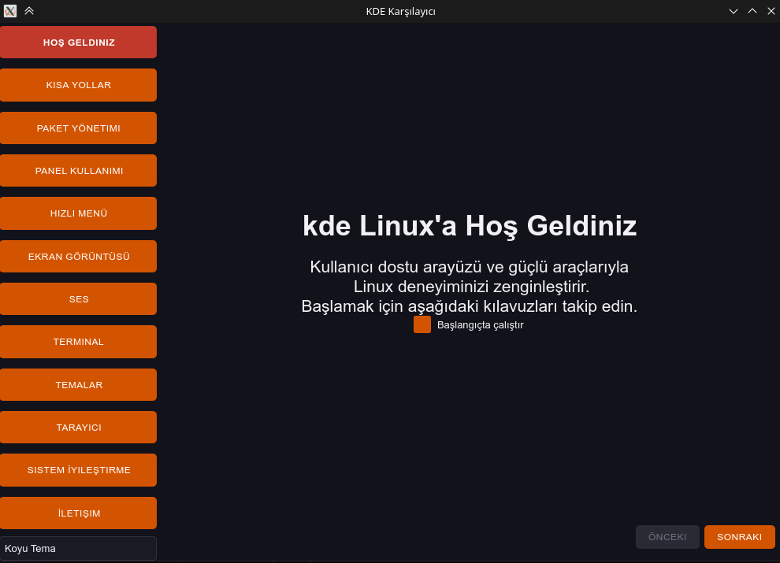
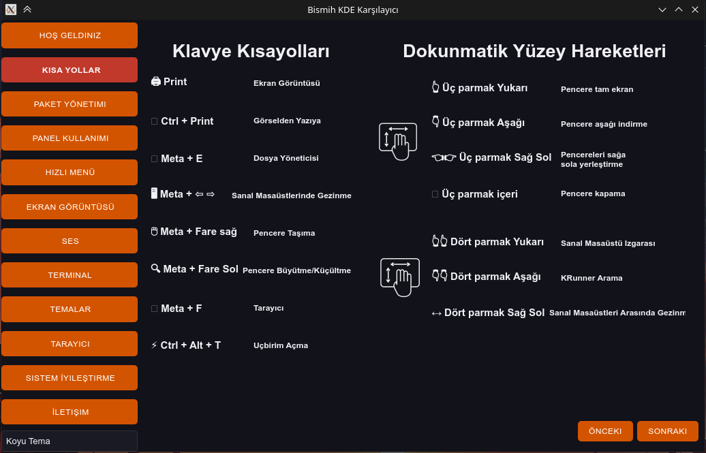
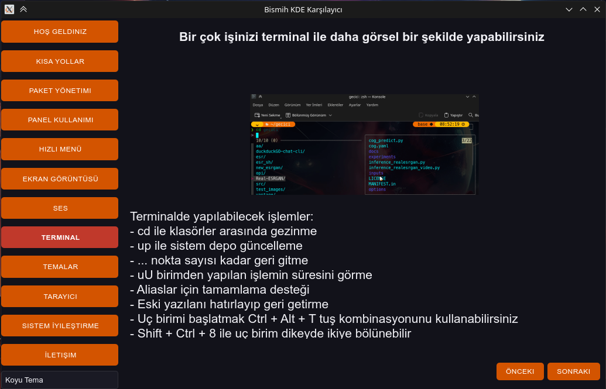

# KDE Welcome

Pardus KDE için kullanıcı dostu karşılama uygulaması. Bu uygulama, yeni kullanıcıların sistem özelliklerini keşfetmesini ve öğrenmesini sağlar.










## 🌟 Özellikler

- **Tema Desteği**: Koyu ve açık tema seçenekleri
- **Etkileşimli Kılavuzlar**: GIF animasyonları ile görsel açıklamalar
- **Kategori Tabanlı Gezinme**: Farklı sistem özelliklerine göre organize edilmiş içerik
- **Otomatik Başlatma**: Sistem başlangıcında otomatik çalıştırma seçeneği

## 📋 Kategoriler

1. **Hoş Geldiniz** - Genel karşılama ve başlangıç bilgileri
2. **Kısa Yollar** - Klavye kısayolları ve touchpad hareketleri
3. **Paket Yönetimi** - Pardus Mağaza, Keşfet Mağaza ve paket yönetimi
4. **Panel Kullanımı** - Sistem paneli ve widget'ları
5. **Hızlı Menü** - Özel menü özellikleri
6. **Ekran Görüntüsü** - Ekran görüntüsü alma ve OCR özellikleri
7. **Ses** - Ses ayarları ve ses efektleri
8. **Terminal** - Terminal kullanımı ve komutlar
9. **Temalar** - Görsel tema ayarları
10. **Tarayıcı** - Zen Browser ve önerilen eklentiler
11. **Sistem İyileştirme** - Sistem optimizasyonu
12. **İletişim** - Topluluk ve destek kanalları

## 🛠️ Teknolojiler

- **Python 3.9+**
- **PyQt6** - Grafik arayüz
- **QMovie** - GIF animasyonları
- **Custom Widgets** - Özel UI bileşenleri

## 📦 Kurulum

### Sistem Bağımlılıkları

```bash
sudo apt install python3-serial python3-requests python3-coloredlogs python3-websockets usbutils
```

### Python Bağımlılıkları

```bash
pip install -r requirements.txt
```

Veya doğrudan:

```bash
pip install PyQt6 pyautogui coloredlogs pyyaml pyxdg
```

## 🚀 Kullanım

### Geliştirme Ortamında Çalıştırma

```bash
python3 main.py
```

### Paketleme

```bash
# Debian paketi oluşturma
sudo apt install devscripts git-buildpackage
sudo mk-build-deps -ir
gbp buildpackage --git-export-dir=/tmp/build/kde-welcome -us -uc --git-ignore-branch --git-ignore-new
```

### Kurulum Sonrası

Uygulama kurulduktan sonra aşağıdaki yollardan erişilebilir:

- **Komut satırı**: `kde-welcome`
- **Uygulama menüsü**: "kde Welcome" uygulaması
- **Otomatik başlatma**: Sistem başlangıcında otomatik çalışır (isteğe bağlı)

## 🏗️ Proje Yapısı

```
kde-welcome/
├── main.py                 # Ana uygulama dosyası
├── setup.py               # Kurulum scripti
├── requirements.txt       # Python bağımlılıkları
├── kde-welcome         # Çalıştırılabilir script
├── kde-welcome.desktop # Desktop entry dosyası
├── data/                  # Veri dosyaları
│   ├── theme.qss         # Tema stil dosyası
│   ├── icons/            # İkon dosyaları
│   ├── images/           # Resim dosyaları
│   └── gifs/             # GIF animasyonları
├── src/                   # Kaynak kod
│   ├── ui/               # Kullanıcı arayüzü
│   │   ├── main_window.py
│   │   ├── categories.py
│   │   ├── components/   # UI bileşenleri
│   │   └── widgets/      # Özel widget'lar
│   ├── theme/            # Tema yönetimi
│   │   └── theme_manager.py
│   └── static/           # Statik konfigürasyon
│       └── config.py
└── debian/               # Debian paketleme
    ├── control
    ├── changelog
    └── ...
```

## 🎨 Tema Sistemi

Uygulama dinamik tema sistemine sahiptir:

- **Koyu Tema**: Modern koyu renkler
- **Açık Tema**: Geleneksel açık renkler
- **Otomatik Tema Değiştirme**: Çalışma zamanında tema değişimi

### Tema Renkleri

```python
# Koyu Tema
ACCENT = "#d35400"          # Ana vurgu rengi
MAIN_BG = "#12121a"         # Ana arkaplan
SECONDARY_BG = "#1a1a24"    # İkinci arkaplan

# Açık Tema
ACCENT = "#d35400"          # Ana vurgu rengi
MAIN_BG = "#f8f8fa"         # Ana arkaplan
SECONDARY_BG = "#ffffff"    # İkinci arkaplan
```

## 🔧 Geliştirme

### Yeni Kategori Ekleme

1. `src/ui/components/` altında yeni component dosyası oluşturun
2. [`Categories`](src/ui/categories.py) sınıfına yeni kategoriyi ekleyin
3. Gerekli ikon dosyalarını `data/icons/` altına ekleyin

### Yeni Widget Ekleme

1. `src/ui/widgets/` altında yeni widget dosyası oluşturun
2. [`BLabel`](src/ui/widgets/BLabel.py) veya [`GifViewer`](src/ui/widgets/gif_viewer.py) gibi mevcut widget'ları örnek alın

### Tema Özelleştirme

[`theme_manager.py`](src/theme/theme_manager.py) dosyasında tema renklerini düzenleyebilirsiniz.

## 🤝 Katkıda Bulunma

1. Fork edin
2. Feature branch oluşturun (`git checkout -b feature/amazing-feature`)
3. Commit edin (`git commit -m 'Add amazing feature'`)
4. Push edin (`git push origin feature/amazing-feature`)
5. Pull Request oluşturun

## 📝 Değişiklik Geçmişi

### v1.0.1 (2025-01-21)
- İlk stabil sürüm
- Temel kategori sistemi
- Tema desteği
- GIF animasyonları

## 📄 Lisans

Bu proje [Apache License 2.0](LICENSE) altında lisanslanmıştır.


## 🙏 Teşekkürler

- **SVG Repo** - İkon dosyaları için
